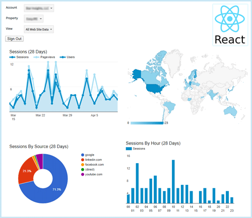

<h2 align="center">
  React Analytics Charts
  <br/>
  <small><a href="https://github.com/devboldly/react-analytics-charts">
    @devboldly/react-analytics-charts
  </a></small>
</h2>
<h3 align="center">
  React components to easily embed Google Analytics charts on your React site.<br/>Uses the <a href="https://react-use-analytics-api.netlify.com/">Google Analytics Embed API</a>.
</h3>
<p align="center">
  <a href="https://badge.fury.io/js/%40devboldly%2Freact-analytics-charts">
    
  </a>
  <a href="https://github.com/devboldly/react-analytics-charts/actions">
    
  </a>
  <a href="https://app.netlify.com/sites/react-analytics-charts/deploys">
    
  </a>
</p>

## Documentation

Read the **[official documentation](https://react-analytics-charts.netlify.com/)**.

[](https://react-analytics-charts.netlify.com/)

#### [👁️ Live Demo](https://react-analytics-charts.netlify.com/AnalyticsDashboard#example)

## Overview

Easily embed Google Analytics charts on your React site using this component library, which leverages the <a href="https://react-use-analytics-api.netlify.app/">Google Analytics Embed API</a>.

Choose from [10+ commonly used drop-in chart components](https://react-analytics-charts.netlify.com/charts#common-charts), or build your own [custom charts](https://react-analytics-charts.netlify.com/charts#custom-charts) and render them as [bar charts](https://react-analytics-charts.netlify.com/BarChart), 
[column charts](https://react-analytics-charts.netlify.com/ColumnChart), [geo charts](https://react-analytics-charts.netlify.com/GeoChart), [line charts](https://react-analytics-charts.netlify.com/LineChart), [pie charts](https://react-analytics-charts.netlify.com/PieChart), and [tables](https://react-analytics-charts.netlify.com/TableChart).

See the [AnalyticsDashboard](https://react-analytics-charts.netlify.com/AnalyticsDashboard) documentation for a **[full live demo](https://react-analytics-charts.netlify.com/AnalyticsDashboard#example)**, or reference any of the available [charts](https://react-analytics-charts.netlify.com/charts) for individual live demo examples.

### Features include:

- **🙌 Simple and quick**
  - Drop Google Analytics [charts](https://react-analytics-charts.netlify.com/charts) onto your React site within minutes.
- **🎁 Pre-made drop-in charts**
  - Choose from [10+ pre-made commonly used charts](https://react-analytics-charts.netlify.com/charts) that you can use right away.
- **⚒️ Easy to build custom charts**
  - Building [your own charts](https://react-analytics-charts.netlify.com/charts) is easy, too!
- **💼 Handles overhead for you**
  - [Dashboard](https://react-analytics-charts.netlify.com/AnalyticsDashboard) handles embed API access, sign-in, sign-out, and view selection for you. Just focus on the [charts](https://react-analytics-charts.netlify.com/charts) you want.
- **✨ Live examples and rich documentation**
  - Quickly refer to docs on queries and charts, all from one place, with plenty of live examples.

## Installation

```
npm i @devboldly/react-analytics-charts
```

## Quick Start

First, you will need an [OAuth Client ID](https://react-analytics-charts.netlify.com/google-oauth-client-id) from Google to access the Analytics API. See [How To Get An OAuth Client ID From Google](https://react-analytics-charts.netlify.com/google-oauth-client-id) to make this as easy and painless as possible.

You can also use an [access token](https://ga-dev-tools.appspot.com/embed-api/server-side-authorization/). See the [`auth` Options docs](https://developers.google.com/analytics/devguides/reporting/embed/v1/component-reference#auth-options) for more information.

### Analytics Dashboard

The [AnalyticsDashboard](https://react-analytics-charts.netlify.com/AnalyticsDashboard) component handles loading the Google Analytics Embed API, sign-in and sign-out, and view selection for you. See the [live demo](https://react-analytics-charts.netlify.com/AnalyticsDashboard#example).

The following example embeds an analytics dashboard with two charts.

Be sure to **change the [`authOptions`](https://developers.google.com/analytics/devguides/reporting/embed/v1/component-reference#auth-options)** to use your [**clientId**](https://react-analytics-charts.netlify.com/google-oauth-client-id) or [**serverAuth.access_token**](https://ga-dev-tools.appspot.com/embed-api/server-side-authorization/).

From there, you can experiment with [other drop-in charts](https://react-analytics-charts.netlify.com/charts#common-charts) or [try creating your own](https://react-analytics-charts.netlify.com/charts#custom-charts).

```jsx
import { AnalyticsDashboard } from '@devboldly/react-analytics-charts';
// Over ten different commonly used charts are available
import { SessionsByDateChart, SessionsGeoChart } from '@devboldly/react-analytics-charts';
```

```jsx
<AnalyticsDashboard
  authOptions={{ clientId: "123456789012-abc123def456ghi789jkl012mno345p.apps.googleusercontent.com" }}
  renderCharts={(gapi, viewId) => {
    return (
      <div>
        <SessionsByDateChart
          gapi={gapi}
          viewId={viewId}
          showPageViews
          showUsers
        />
        <SessionsGeoChart 
          gapi={gapi} 
          viewId={viewId} 
          showPageViews 
        />
        ... More charts here ...
      </div>
    );
  }}
/>
```

See the [Charts Overview](https://react-analytics-charts.netlify.com/charts) for more charts, and [AnalyticsDashboard](https://react-analytics-charts.netlify.com/AnalyticsDashboard) for more information on the dashboard itself.

### Standalone Charts

All of the charts in this library can be used standalone.

If you have the [Google Analytics Embed API](https://react-use-analytics-api.netlify.app/) (`gapi`) loaded and ready, and you know [which view ID](https://react-analytics-charts.netlify.com/ViewSelector#example) to query, you can pick any of the [available charts](https://react-analytics-charts.netlify.com/charts) and drop them right onto your site as [standalone charts](https://react-analytics-charts.netlify.com/custom-dashboards-standalone-charts#standalone-charts).

For example, if your view ID is `ga:123456789`:

```jsx
import { SessionsByDateChart } from '@devboldly/react-analytics-charts';
```

```jsx
<SessionsByDateChart gapi={gapi} viewId="ga:123456789" />
```

You must be authorized. You can use the [ViewSelector demo](https://react-analytics-charts.netlify.com/ViewSelector#example) to determine your view ID, and the [useAnalyticsApi](https://react-use-analytics-api.netlify.com/useAnalyticsApi) hook to easily load the `gapi` API and authorize. If you use the [AnalyticsDashboard](https://react-analytics-charts.netlify.com/AnalyticsDashboard), this will all be handled for you.

## TypeScript

Type definitions have been included for [TypeScript](https://www.typescriptlang.org/) support.

## Contributing

Open source software is awesome and so are you. 😎

Feel free to submit a pull request for bugs or additions, and make sure to update tests as appropriate. Even the smallest changes help.

For major changes, open an issue first to discuss what you'd like to change.

## ⭐ Found It Helpful? [Star It!](https://github.com/devboldly/react-analytics-charts/stargazers)

More stars means more development love. So if you found this project helpful, [star it](https://github.com/devboldly/react-analytics-charts/stargazers)! [👉⭐](https://github.com/devboldly/react-analytics-charts/stargazers)

## License

This project is covered under the [MIT License](https://en.wikipedia.org/wiki/MIT_License):

```
Copyright © 2020 DevBoldly https://devboldly.com

Permission is hereby granted, free of charge, to any person obtaining a copy
of this software and associated documentation files (the "Software"), to deal
in the Software without restriction, including without limitation the rights
to use, copy, modify, merge, publish, distribute, sublicense, and/or sell
copies of the Software, and to permit persons to whom the Software is
furnished to do so, subject to the following conditions:

The above copyright notice and this permission notice shall be included in all
copies or substantial portions of the Software.

THE SOFTWARE IS PROVIDED "AS IS", WITHOUT WARRANTY OF ANY KIND, EXPRESS OR
IMPLIED, INCLUDING BUT NOT LIMITED TO THE WARRANTIES OF MERCHANTABILITY,
FITNESS FOR A PARTICULAR PURPOSE AND NONINFRINGEMENT. IN NO EVENT SHALL THE
AUTHORS OR COPYRIGHT HOLDERS BE LIABLE FOR ANY CLAIM, DAMAGES OR OTHER
LIABILITY, WHETHER IN AN ACTION OF CONTRACT, TORT OR OTHERWISE, ARISING FROM,
OUT OF OR IN CONNECTION WITH THE SOFTWARE OR THE USE OR OTHER DEALINGS IN THE
SOFTWARE.
```